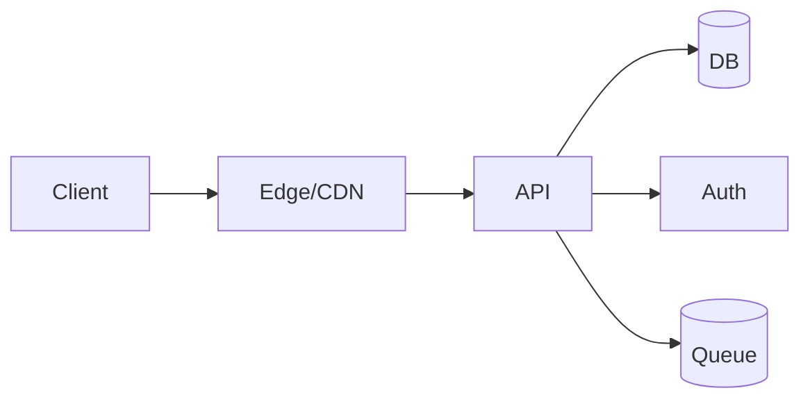

# Enterprise Deliverable — technical due diligence
owner: Core Platform Team • date: 2025-08-21 • trace: rlxibj2s

## 1. intent & constraints
- intent: Hardened, privacy-first system for enterprise workloads
- deliverables: report, web, api
- constraints: team=6, timeline=12w, region=eu, pii=true, payments=true

## 2. requirements
- functional: F-1 core, F-2 auth, F-3 persistence
- non-functional: latency p95 ≤ 250ms; availability ≥ 99.5%; cost ≤ $1000/mo

## 3. architecture
baseline: Next.js + Node API on Cloud (custom); db=Managed Postgres (EU); auth=Hosted Auth (OIDC/OAuth)

alternatives: Alt1: Monolith; Alt2: Modular services
rationale: team=6, exp=advanced, pii=true, payments=true, region=eu

## 4. security & privacy (stride)
- S: OIDC/OAuth, short-lived sessions | T: Parameterized queries, signed requests | R: Append-only audit log | I: Private buckets, signed URLs, DLP on PII | D: Rate limiting + backpressure | E: RBAC + least privilege
data classification: PII • residency: EU

**auto-inclusions:**
PCI Note: Use hosted checkout (e.g., Stripe Checkout) to stay in SAQ-A scope.
GDPR/CCPA: Add consent, retention policy, and DPA with vendors.
EU Residency: Ensure databases and analytics are EU-hosted; add SCCs if needed.

## 5. tests & enforcement
coverage: now 80% → rc 90%; mutation modules: auth
performance SLOs and failure budgets defined.

## 6. delivery plan
P1 (6w): Auth + Core CRUD + Basic tests • P2 (6w): Analytics + Polishing + Docs
risks: scope creep; under-specified NFRs → mitigations: explicit ACs; phased delivery; guardrails in CI
