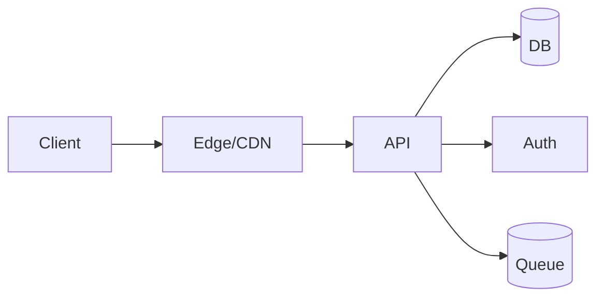

# Default Deliverable — technical due diligence
owner: Team • date: 2025-08-21 • trace: vg45njj1

## 1. intent & constraints
- intent: Baseline deliverable generation in CI
- deliverables: report, web, api
- constraints: team=2, timeline=6w, region=us, pii=false, payments=false

## 2. requirements
- functional: F-1 core, F-2 auth, F-3 persistence
- non-functional: latency p95 ≤ 250ms; availability ≥ 99.5%; cost ≤ $200/mo

## 3. architecture
baseline: Next.js + Node API on Managed Host; db=Lite DB or KV; auth=Email-link

alternatives: Alt1: Monolith; Alt2: Modular services
rationale: team=2, exp=advanced, pii=false, payments=false, region=us

## 4. security & privacy (stride)
- S: OIDC/OAuth, short-lived sessions | T: Parameterized queries, signed requests | R: Append-only audit log | I: Private buckets, signed URLs, DLP on PII | D: Rate limiting + backpressure | E: RBAC + least privilege
data classification: Low-risk data • residency: US

**auto-inclusions:**
Small Team: Prefer managed services to reduce operational load.
Tight Timeline: Defer non-essentials to Phase 2; focus on core ACs.

## 5. tests & enforcement
coverage: now 80% → rc 90%; mutation modules: auth
performance SLOs and failure budgets defined.

## 6. delivery plan
P1 (3w): Auth + Core CRUD + Basic tests • P2 (3w): Analytics + Polishing + Docs
risks: scope creep; under-specified NFRs → mitigations: explicit ACs; phased delivery; guardrails in CI
