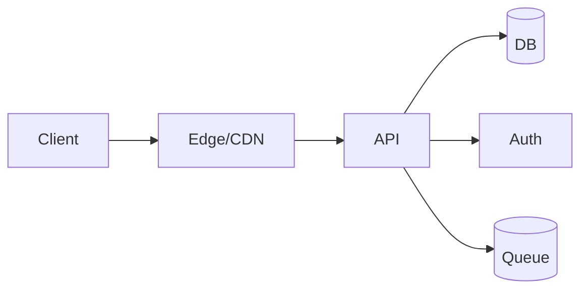

# {{project.name}} — technical due diligence
owner: {{owner.name}} • date: {{date}} • trace: {{trace.id}}

## 1. intent & constraints
- intent: {{intent.one_liner}}
- deliverables: {{deliverables}}
- constraints: team={{team.size}}, timeline={{timeline.weeks}}w, region={{region}}, pii={{data.pii}}, payments={{payments}}

## 2. requirements
- functional: {{req.functional}}
- non-functional: latency p95 ≤ {{nfr.latency_ms}}ms; availability ≥ {{nfr.slo}}; cost ≤ ${{nfr.budget}}/mo

## 3. architecture
baseline: {{arch.stack}} on {{arch.hosting}}; db={{arch.db}}; auth={{arch.auth}}

alternatives: {{arch.alternatives}}
rationale: {{arch.rationale}}

## 4. security & privacy (stride)
- S: {{security.spoofing}} | T: {{security.tampering}} | R: {{security.repudiation}} | I: {{security.info}} | D: {{security.dos}} | E: {{security.eop}}
data classification: {{security.classification}} • residency: {{security.residency}}

**auto-inclusions:**
{{auto.inclusions}}

## 5. tests & enforcement
coverage: now {{tests.coverage_now}} → rc {{tests.coverage_rc}}; mutation modules: {{tests.mutation}}
performance SLOs and failure budgets defined.

## 6. delivery plan
P1 ({{plan.p1.w}}w): {{plan.p1.scope}} • P2 ({{plan.p2.w}}w): {{plan.p2.scope}}
risks: {{plan.risks}} → mitigations: {{plan.mitigations}}
