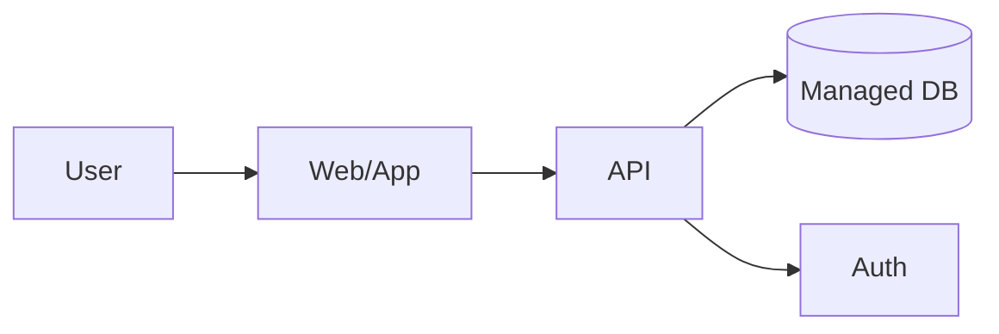

# {{project.name}} — due diligence report
Prepared for {{owner.name}} • {{date}}

## 0. executive summary
**what we’re building:** {{intent.one_liner}}
**audience:** {{audience}}
**deliverables:** {{deliverables}}

---
## 1. scope & acceptance criteria
**in scope:** {{deliverables}}
**acceptance criteria (mvp):**
- [ ] core features defined and testable
- [ ] security checklist completed
- [ ] deployable build produced

---
## 2. recommended architecture (why)
stack: {{arch.stack}} • hosting: {{arch.hosting}} • db: {{arch.db}} • auth: {{arch.auth}}

rationale: {{arch.rationale}}

---
## 3. security & privacy snapshot
- data classification: {{security.classification}}
- stride quick controls: {{security.stride_summary}}

**auto-inclusions:**
{{auto.inclusions}}

---
## 4. non-functional targets
- latency p95: {{nfr.latency_ms}} ms
- availability: {{nfr.slo}}
- budget/month: ${{nfr.budget}}

---
## 5. build plan
- phase 1 ({{plan.p1.w}}w): {{plan.p1.scope}}
- phase 2 ({{plan.p2.w}}w): {{plan.p2.scope}}

---
## 6. operations & tests
- cicd: lint, typecheck, tests, coverage, secrets scan
- coverage: now {{tests.coverage_now}} → rc {{tests.coverage_rc}}
- abuse cases: rate limit, auth bypass, input validation

*trace: {{trace.id}}*
